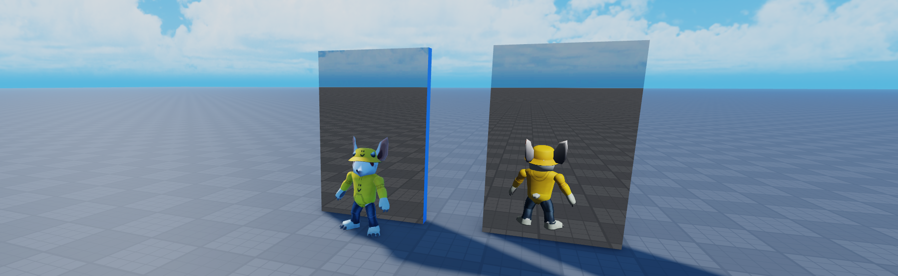
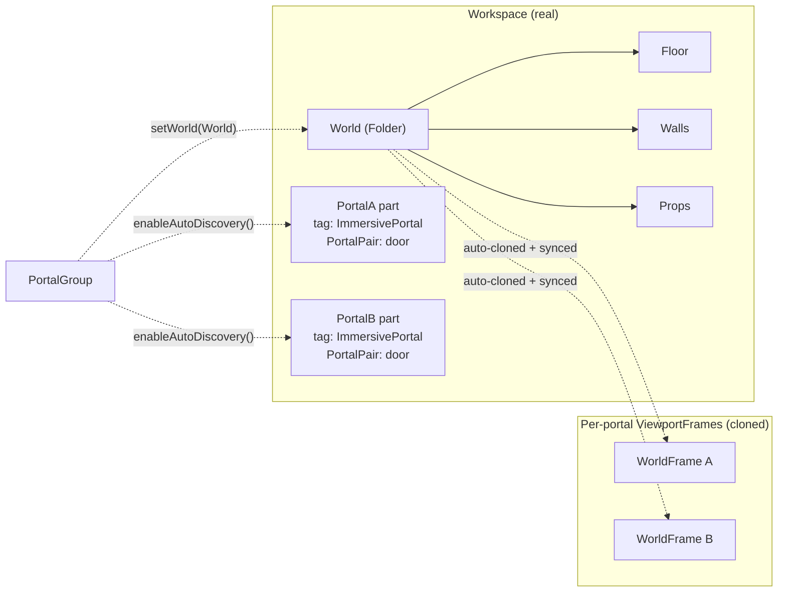

# @rbxts/immersive-portals



Perspective-correct portal rendering for [roblox-ts](https://roblox-ts.com). Two paired surfaces become real-looking windows into each other — and walk through them to teleport.

```ts
import { Portal, PortalGroup, PortalWindow } from "@rbxts/immersive-portals";
```

## Install

```bash
npm install @rbxts/immersive-portals
```

## Quick start

In a client controller (Flamework / vanilla LocalScript):

```ts
import { PortalGroup } from "@rbxts/immersive-portals";
import { Workspace } from "@rbxts/services";

const group = new PortalGroup({ autoDiscoverTag: "ImmersivePortal" });
group.enableAutoDiscovery();
group.setWorld(Workspace.WaitForChild("World"));
group.trackAllPlayers();
group.bind();
```

In Studio: drop two `BasePart`s in `Workspace`, tag both with `ImmersivePortal`, set a matching `PortalPair` string attribute on each. Done — they pair up and render.

Everything visual in the portal viewport comes from `Workspace.World` (any name; whatever you pass to `setWorld`). Put your scenery in that folder, and the library clones it into each portal's `ViewportFrame` — keeping it auto-synced on `ChildAdded`/`ChildRemoved`.

## How the World folder gets cloned



Add anything new to `World` at runtime — it appears in every portal's viewport automatically. Remove it — it disappears. The Camera, Terrain, and any character registered via `addCharacter` / `trackAllPlayers` are excluded automatically so they don't double-render.

## Three layers

The library is composable. Most consumers only need `PortalGroup`. The lower layers are useful on their own — `PortalWindow` is a generic "magic window" (security cameras, fish tanks, magic mirrors).

### `PortalGroup` — many portals, one render loop

Auto-discovers tagged portal parts via CollectionService, shares one `RenderStepped` callback across all of them.

```ts
const group = new PortalGroup({
  autoDiscoverTag: "ImmersivePortal",
  pairAttribute: "PortalPair",
  faceAttribute: "PortalFace", // optional integer NormalId per part
  defaultPortalConfig: { teleportCooldown: 0.2 }, // applied to every discovered pair
});
group.enableAutoDiscovery();
group.setWorld(Workspace.World);
group.trackAllPlayers();
group.bind();
```

### `Portal` — paired teleporter

Two parts → two `PortalWindow`s plus the mirror-camera loop and teleport check.

```ts
const portal = new Portal(partA, partB, {
  surfaceA: Enum.NormalId.Front,
  surfaceB: Enum.NormalId.Front,
  teleportCooldown: 0.1,
});
portal.setWorld(Workspace.PortalScene);
portal.setHumanoid(Players.LocalPlayer.Character!.FindFirstChildOfClass("Humanoid"));
portal.addCharacter(Players.LocalPlayer.Character!);
portal.teleported.Connect((from, to) => print(`${from} → ${to}`));
portal.bind();
```

`bind()` is only for standalone usage. Inside a `PortalGroup`, the group owns the render loop and calls `Portal.update` directly — don't bind individually.

### `PortalWindow` — render primitive

A perspective-correct `ViewportFrame` on a part face. Standalone-useful.

```ts
const window = PortalWindow.fromPart(part, Enum.NormalId.Front, part, {
  canvasSize: new Vector2(1024, 1024),
  lightingMode: "snapshot",
});
window.setSkybox(Lighting.FindFirstChildOfClass("Sky"));
window.cloneInto([Workspace.OtherRoom]);

RunService.RenderStepped.Connect(() => {
  const cam = Workspace.CurrentCamera;
  if (cam) window.render(cam.CFrame);
});
```

## Setup checklist

Two things that will trip you up:

1. **Both portal parts need `tag = "ImmersivePortal"` and a matching `PortalPair` attribute** for auto-discovery. The library waits until both halves are tagged to actually build the portal.
2. **The `SurfaceGui` ends up under `PlayerGui`, not on the part.** `ViewportFrame` content silently fails to render when the SurfaceGui is a direct child of a `BasePart` — only flat Frames render in that case. `PortalWindow.fromPart` handles this for you (`Adornee = part`, parent = `LocalPlayer.PlayerGui`, `ResetOnSpawn = false`).

## Edge cases

### Front face only

The library mounts the visible viewport on each part's Front face by default. Walk-through detection is bidirectional (you can enter from either face), but the back face renders as the bare part. Aim Front toward where players approach. Override per-part via the `PortalFace` integer attribute (a `NormalId` enum value).

### Character cloning timing

`Player.CharacterAdded` fires before body parts and accessories replicate. Calling `addCharacter` immediately clones a Shirt+Humanoid stub. `trackAllPlayers()` does the right thing (waits for `Humanoid`, `HumanoidRootPart`, and `CharacterAppearanceLoaded`). If you wire it manually, do the same.

### Tag stripping on clones

`cloneInto` strips CollectionService tags from every clone it produces. ViewportFrame contents are display-only; leaving tags on them re-fires `GetInstanceAddedSignal` for the auto-discovery layer and cascades into exponential portal creation. If you need tagged clones for some reason, re-tag them inside `cloneFunc`.

### `World` can be a Folder or Model

Pass anything; `cloneInto` recurses its children. Top-level `ChildAdded`/`ChildRemoved` are auto-synced. Deep additions (descendants of an already-cloned subtree) are NOT — call `setWorld` again to re-snapshot.

### Stateful effects are skipped

`Sound`, `ParticleEmitter`, `Beam`, and `Trail` instances on cloned characters/scenery are skipped during clone. Sounds in particular would otherwise freeze in their current `Playing` state (no Humanoid to update them) and produce ghost footstep loops.

### Remote-player teleport smoothing

Local-player teleport is instant (direct `HumanoidRootPart.CFrame` assignment). Other players' characters interpolate over Roblox's ~100ms character network smoothing — no engine API disables this. Listen for `portal.teleported` and broadcast a server-side snap if you need pixel-perfect remote teleports.

## Lighting

ViewportFrames don't render `Atmosphere`, `Clouds`, or `Sky` natively. The library provides a manual skybox proxy and exposes `lightingMode`:

| Mode | When to use |
|---|---|
| `"snapshot"` (default) | Sample `Lighting.OutdoorAmbient`, `Lighting.ColorShift_Top`, and `Lighting:GetSunDirection()` once at construction. Best out-of-the-box match to the surrounding world. |
| `"manual"` | You set `ambient` + `lightColor` + `sunDirection` yourself. Most predictable. |
| `"live"` | Re-sample each frame. Use for day-night cycles. Slight cost per window. |

## Limitations

### No post-processing in viewports

**Expect the portal view to look flatter than the main render.** ViewportFrame does not run any post-processing — no bloom, sun rays, depth of field, color correction, atmosphere scattering, or tonemapping — even when those effects are present in the parent place's `Lighting`. The library samples the three lighting inputs a ViewportFrame *does* support (`Ambient`, `LightColor`, `LightDirection`) and that's the ceiling Roblox gives us. A portal in a place with heavy atmosphere/bloom will read noticeably darker and less saturated than the world around it; no engine-supported workaround exists. Pre-multiplying `LightColor` to compensate just blows out highlights without restoring the missing effects, so the library intentionally doesn't do that — set expectations rather than fight the renderer.

### No nested-portal recursion

The Portal-game effect of one portal looking through itself into an infinite tunnel is **not possible** in Roblox. `ViewportFrame` doesn't render nested GUIs — if a partner portal part is visible in the cloned world, you see its bare geometry, not its viewport graphic. Roblox exposes no offscreen-render-to-texture or feedback-pass primitive, so true recursion can't be faked. Treat partner portals in view as flat surfaces.

## API surface

**Classes:** `PortalWindow`, `Portal`, `PortalGroup`

**Pure functions:**
- `createSkyboxModel(sky | config)` — `Sky` or `SkyboxConfig` → 6-part skybox `Model`
- `mirrorCFrameForCamera(cf, planeA, planeB)`, `mirrorCFrameForTeleport(cf, planeA, planeB)`
- `rayPlane(origin, direction, planePoint, planeNormal)`
- `segmentCrossesRect(from, to, planeCFrame, planeSize)` (one-way; used for camera-through-portal)
- `segmentCrossesRectBidirectional(from, to, planeCFrame, planeSize)` (used for teleport)
- `snapshotLighting()`, `resolveLighting(config)`, `applyLightingToFrame(frame, snapshot)`

**Types:** `WindowConfig`, `PortalConfig`, `PortalGroupConfig`, `SkyboxConfig`, `LightingMode`, `LightingSnapshot`

## License

MIT
